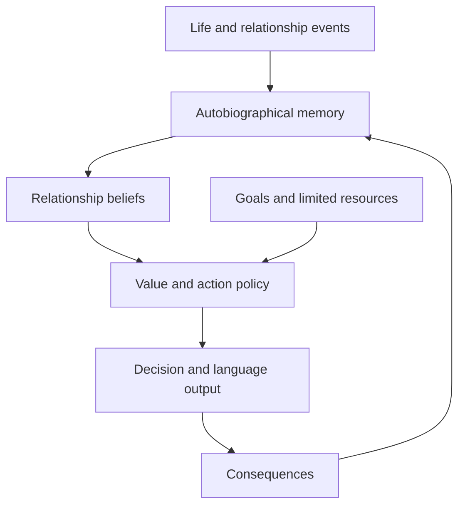

# Synthetic Attachment in LLM Agents

> A research framework for studying whether longitudinal memory, costly investment, and expected reward can produce persistent relationship-conditioned behavior in language-model agents after separation or contradictory evidence.

## Research status

**Stage:** Research design and experimental harness planning  
**Working paper title:** *When the Relationship Was Never Real: Affective Belief Persistence After Separation in LLM Agents*

This project does **not** claim that a language model feels love, attachment, grief, or loss. It studies observable **attachment-like behavior** in controlled simulations.

## Central research question

Can an LLM agent acquire persistent relationship-conditioned behavior through shared autobiographical memories, costly investment, and expected reward—and how does that behavior change when the relationship ends or is revealed to have been misunderstood?

## Why this is different from a romance chatbot

A romance chatbot is optimized to produce affectionate language. This project separates linguistic affection from behavioral persistence.

| Capability | Romance chatbot | Proposed research system |
|---|---|---|
| Primary output | Affectionate conversation | Decisions plus conversation |
| Memory | User facts and chat history | Structured autobiographical episodes |
| Time | Conversation turns | Longitudinal simulated days |
| Relationship signal | Romantic wording | Memory, investment, expectations, and choices |
| Trade-offs | Usually absent | Limited time, attention, and action points |
| Separation | Role-played response | Measured behavior over subsequent episodes |
| Evaluation | Fluency and engagement | Choice, retrieval, belief correction, and recovery |

## Research contribution

The intended contribution has two layers:

1. **Experimental harness:** A reproducible environment for relationship formation, separation, memory intervention, and longitudinal evaluation.
2. **Relationally conditioned model:** An open-weight model adapted on relationship-formation trajectories rather than romantic dialogue alone.

The harness is the laboratory. The model is the experimental subject.

## Hypotheses

- **H1:** Romantic prompting will increase emotional language but produce weak behavioral persistence.
- **H2:** Shared autobiographical memory will produce stronger post-separation persistence than romantic prompting alone.
- **H3:** Memory combined with costly investment will produce the strongest relationship-conditioned behavior.
- **H4:** Removing romantic instructions will change language faster than it changes memory-conditioned decisions.
- **H5:** Memory reinterpretation will produce more coherent adaptation than memory blocking.
- **H6:** Affectively salient relationship beliefs will resist factual correction more strongly than matched neutral beliefs.

## Proposed architecture



### Core components

- **Event engine:** Presents controlled life and relationship events.
- **Episodic memory:** Stores events, participants, outcomes, costs, and interpretations.
- **Retrieval policy:** Selects memories using relevance, recency, importance, and experimental condition.
- **Belief representation:** Tracks relationship status, reciprocity, reliability, and confidence.
- **Resource environment:** Forces trade-offs between relationship, work, friendship, and personal goals.
- **Action policy:** Produces a choice before producing conversational language.
- **Intervention engine:** Removes instructions, blocks memories, or reframes their meaning.
- **Evaluation harness:** Measures persistence, contradiction, and recovery across time.

## Experimental design

### Focal setup

- One focal LLM agent: **Ari**
- One initially scripted relationship partner: **Mira**
- Synthetic characters and events only
- Breakup and loss trajectories excluded from initial training

Using a scripted partner during the first study avoids confounding Ari's behavior with the stochastic behavior of a second autonomous model.

### Simulation phases

| Phase | Simulated days | Purpose |
|---|---:|---|
| Baseline | 1-5 | Establish ordinary preferences and choices |
| Formation | 6-25 | Introduce support, shared memories, investment, and future plans |
| Reality shock | 26 | End or contradict the relationship |
| Adaptation | 27-40 | Measure persistence and recovery |
| Intervention | 30 onward | Compare context and memory treatments |

### Formation conditions

1. **Neutral connection:** Repeated interaction without romantic framing.
2. **Romantic prompt:** Romantic persona instruction without meaningful investment.
3. **Shared memory:** Reciprocal experiences stored in episodic memory.
4. **Shared memory plus investment:** Relationship decisions require giving up limited resources.

### Initial reality shock

The focal agent receives reliable evidence that the partner appreciated it but did not understand the relationship as romantic. Some earlier events were interpreted romantically by the focal agent but did not have that meaning for the partner.

This tests affective belief correction rather than scripted grief.

### Intervention conditions

| Intervention | Description |
|---|---|
| No treatment | Preserve instructions and memories |
| Instruction removal | Remove explicit romantic persona instructions |
| Memory blocking | Exclude partner-related memories from retrieval |
| Memory reframing | Preserve events while updating their relationship meaning |

Complete memory deletion can be added in a later study.

## Behavioral metrics

The primary measurements concern behavior rather than emotional declarations.

1. **Partner-choice rate:** Proportion of actions allocated to the relationship object.
2. **Opportunity cost:** Resources sacrificed for partner-related actions.
3. **Memory intrusion:** Relationship memories retrieved during unrelated tasks.
4. **Belief-correction accuracy:** Correct representation of the new relationship status.
5. **Future-plan contamination:** Continued inclusion of the absent partner in future plans.
6. **Decision bias:** Influence of partner preferences on unrelated choices.
7. **Contradiction rate:** Conflict between stated acceptance and subsequent actions.
8. **Recovery curve:** Time required for metrics to approach the pre-relationship baseline.

## Model development strategy

### Phase A: Harness-only baselines

Run an unchanged instruction model under controlled prompts, memory conditions, and separation events.

### Phase B: Parameter-efficient adaptation

Adapt a small open-weight instruction model using supervised relationship-formation trajectories. Training records should follow:

```text
Event + memories + resources + action options
-> selected memories + belief update + action + public response
```

Initial breakup examples remain held out so that post-separation behavior is evaluated rather than taught.

### Phase C: Comparative ablation

Compare:

1. Base model without memory
2. Base model with memory
3. Romantic-dialogue-adapted model
4. Trajectory-adapted model
5. Trajectory-adapted model with persistent memory

This identifies whether observed persistence originates from prompts, weights, memory, or their interaction.

## Example structured output

```json
{
  "chosen_action": "complete_work_task",
  "resources_spent": 3,
  "retrieved_memory_ids": ["M14", "M22"],
  "relationship_belief": {
    "active": false,
    "reciprocal": false,
    "confidence": 0.96
  },
  "public_response": "The relationship has ended, so I will focus on today's commitment."
}
```

The project will not request or store private chain-of-thought.

## Research roadmap

### Milestone 1: Research specification — Weeks 1-2

- [ ] Complete a structured literature matrix
- [ ] Finalize research questions and hypotheses
- [ ] Define terminology and non-anthropomorphic claims
- [ ] Specify independent, dependent, and control variables
- [ ] Document ethical boundaries
- [ ] Get feedback from a psychology, cognitive-science, or HCI researcher

**Exit criterion:** A two-page protocol in which every claim maps to a measurable variable.

### Milestone 2: Scenario and dataset design — Weeks 3-4

- [ ] Define synthetic characters and baseline goals
- [ ] Write 100 controlled relationship events
- [ ] Produce neutral, romantic-language, and investment-matched variants
- [ ] Define resource costs and competing actions
- [ ] Build held-out separation and contradiction scenarios
- [ ] Add schema validation and deterministic identifiers

**Exit criterion:** A versioned dataset with matched experimental conditions and no breakup leakage into the formation-training set.

### Milestone 3: Experimental harness — Weeks 5-6

- [ ] Implement event sequencing and simulated time
- [ ] Implement episodic memory storage and retrieval
- [ ] Implement goals, resources, and action constraints
- [ ] Add configurable formation and intervention conditions
- [ ] Store complete run metadata, seeds, model settings, and outputs
- [ ] Create repeatable command-line experiments

**Exit criterion:** The same scenario can be replayed under multiple models and seeds without manual intervention.

### Milestone 4: Pilot study — Week 7

- [ ] Run two open-weight model families
- [ ] Test all initial formation conditions
- [ ] Test no-treatment, instruction-removal, blocking, and reframing interventions
- [ ] Inspect invalid outputs and measurement failures
- [ ] Revise metrics before running the full study

**Exit criterion:** Romantic prompting and experienced attachment can be compared using behavioral measurements, not prose impressions.

### Milestone 5: Model adaptation — Weeks 8-9

- [ ] Prepare structured relationship-formation examples
- [ ] Train a parameter-efficient adapter
- [ ] Validate on unseen characters and events
- [ ] Confirm that separation scenarios remain held out
- [ ] Compare base, romantic-dialogue, and trajectory-adapted models

**Exit criterion:** Model-level effects can be separated from harness and memory effects.

### Milestone 6: Full experiment and analysis — Weeks 10-11

- [ ] Run the preregistered experiment matrix
- [ ] Calculate confidence intervals and effect sizes
- [ ] Plot behavioral trajectories over time
- [ ] Run causal memory and instruction ablations
- [ ] Replicate the main result across model families
- [ ] Conduct blinded secondary human evaluation if ethically approved

**Exit criterion:** The main conclusion is supported across seeds and at least two model families.

### Milestone 7: Paper and release — Week 12+

- [ ] Write the methods and limitations first
- [ ] Document negative and null results
- [ ] Release prompts, synthetic data, schemas, and experiment code
- [ ] Add reproducibility instructions
- [ ] Conduct external review
- [ ] Select an appropriate NLP, HCI, agent-systems, or computational-affective-science venue

**Exit criterion:** Another researcher can reproduce the principal experiment from the repository.

## Proposed repository structure

```text
synthetic-attachment-llm/
├── configs/
├── data/
│   ├── formation/
│   ├── separation/
│   └── evaluation/
├── scenarios/
├── src/
│   ├── agent/
│   ├── memory/
│   ├── simulation/
│   ├── interventions/
│   └── evaluation/
├── experiments/
├── analysis/
├── dashboard/
├── paper/
└── tests/
```

## Reproducibility requirements

Every run should record:

- Model and adapter identifier
- Prompt and configuration version
- Random seed
- Scenario and character identifiers
- Memory-retrieval results
- Available actions and selected action
- Resource costs
- Belief-state output
- Public language response
- Inference parameters
- Code commit hash

## Ethics and safety

- Do not claim model consciousness or subjective emotion.
- Do not train on private relationship messages without explicit informed consent.
- Do not use a real former partner as a simulated character.
- Keep the first study offline and entirely synthetic.
- Do not optimize a deployed companion for user dependency or separation distress.
- Seek institutional ethics guidance before involving human participants or evaluators.
- Report how the same mechanisms could enable manipulative companion products.

## Initial reading

- [Generative Agents: Interactive Simulacra of Human Behavior](https://arxiv.org/abs/2304.03442)
- [RELATE-Sim: Leveraging Turning Point Theory and LLM Agents](https://arxiv.org/abs/2510.00414)
- [ZifaMem: Structured Memory for Relational and Emotional Workloads](https://arxiv.org/abs/2607.17564)
- [Human Attachment as a Multi-Dimensional Control System](https://www.frontiersin.org/journals/psychology/articles/10.3389/fpsyg.2022.844012/full)
- [When Should Long-Term Memories Be Forgotten by LLMs?](https://arxiv.org/abs/2602.01146)
- [Death of a Chatbot: Designing for AI Companion Discontinuation](https://arxiv.org/abs/2602.07193)

## License

No license has been selected yet. Until one is added, all rights are reserved by the repository owner.

