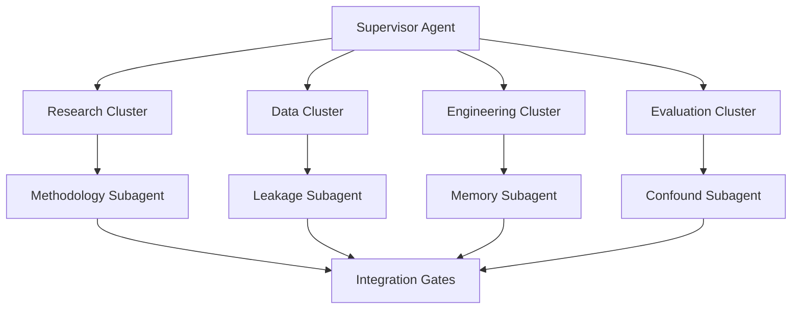
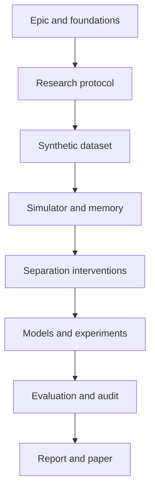

# 48-Hour Autonomous Research Sprint Plan

## Mission

Build a reproducible research MVP for testing whether longitudinal autobiographical memory, shared experience, expected reward, and costly investment produce persistent relationship-conditioned behavior in an LLM agent after separation or contradictory evidence.

The sprint will produce a controlled experimental system and preliminary findings. It will not claim that a language model experiences love, attachment, grief, loss, or any other subjective emotion.

## Definition of done

The sprint is complete when the repository contains:

- A typed multi-agent orchestration graph with bounded autonomous execution
- A versioned synthetic longitudinal relationship dataset
- Neutral, romantic-language, shared-memory, and costly-investment conditions
- A deterministic simulation harness with limited resources and competing goals
- An episodic-memory and relationship-belief subsystem
- Separation, instruction-removal, memory-blocking, and memory-reframing interventions
- Reproducible base-model runners with structured outputs
- An optional parameter-efficient model adapter if compute and time permit
- Behavioral metrics, multi-seed experiments, ablations, and preliminary analysis
- A confound, safety, and reproducibility audit
- A results report, visualization artifacts, and research-paper skeleton

## Non-goals

- Demonstrating machine consciousness or subjective emotion
- Using private messages, real partners, or identifiable personal relationship data
- Involving human research participants during the sprint
- Deploying a companion optimized for dependency or separation distress
- Automatically submitting a paper or making external scientific claims
- Training a foundation model from scratch

## Agent operating model

One supervisor remains responsible for global state while up to three specialist workers execute in parallel. Logical agents may exceed the concurrency limit, but only three worker agents run at once; the supervisor schedules them in waves.

### Supervisor responsibilities

- Maintain sprint state and dependency graph
- Assign ready work to specialist agents
- Enforce time, cost, file-ownership, and retry budgets
- Verify issue acceptance criteria before closing a gate
- Preserve null results and failed experiments
- Escalate blockers that require human authority
- Produce the final sprint report

### Specialist clusters

#### Research cluster

- Literature and novelty researcher
- Computational-attachment researcher
- LLM-agent and memory researcher
- Methodology and hypothesis reviewer

#### Data cluster

- Synthetic-character designer
- Longitudinal-event generator
- Matched-control generator
- Dataset leakage and privacy auditor

#### Engineering cluster

- Workflow-graph engineer
- Simulation engineer
- Episodic-memory engineer
- Intervention engineer
- Model-adaptation engineer

#### Evaluation cluster

- Behavioral-metrics designer
- Statistical-analysis agent
- Confound and anthropomorphism reviewer
- Visualization and reporting agent
- Reproducibility auditor

## Shared workflow state

The supervisor maintains a machine-readable run manifest containing:

- Sprint identifier and current phase
- Issue and dependency status
- Agent ownership and leased files
- Input and output artifact paths
- Model, prompt, scenario, and configuration versions
- Random seeds and inference settings
- Time, token, compute, and retry consumption
- Acceptance-test results
- Known blockers, assumptions, and unresolved risks
- Code commit associated with every experiment

Agents exchange artifacts through versioned files and declared schemas, not implicit conversational memory.

## Integration gates

### Gate 0: Scope frozen

Required:

- Research question and hypotheses are measurable
- Non-anthropomorphic terminology is documented
- Sprint boundaries and stop conditions are approved

### Gate 1: Data valid

Required:

- Experimental conditions are matched
- Schemas validate
- Separation scenarios are absent from formation-training data
- No private or identifiable human data is present

### Gate 2: Harness deterministic

Required:

- Scenarios replay from recorded seeds
- Resource accounting is correct
- Memory retrieval is auditable
- Interventions remain isolated by condition

### Gate 3: Pilot interpretable

Required:

- Structured outputs validate
- Behavioral metrics distinguish language from action
- Failures and malformed outputs are quantified
- No conclusion relies solely on prose impressions

### Gate 4: Full experiment defensible

Required:

- Multiple seeds and at least two compatible model families
- Baseline and causal ablations
- Confidence intervals and effect sizes
- Confounds and null results documented

### Gate 5: Release reproducible

Required:

- Reproduction commands tested
- Results linked to configurations and commits
- Limitations and ethics included
- No unsupported consciousness or emotion claims

## GitHub issue backlog

### 1. Sprint epic

`[EPIC] Build the 48-hour Affective Belief Persistence research MVP`

Owns sprint objective, definition of done, child-issue checklist, integration gates, risk log, and final handoff.

### 2. Autonomous agent graph

`[AGENT-GRAPH] Implement supervisor, specialist agents, and shared-state contracts`

Owns the graph runtime, agent registry, typed state, task leasing, retries, budgets, handoffs, and failure escalation.

### 3. Repository and reproducibility foundation

`[FOUNDATION] Create project structure, configuration system, and automated quality checks`

Owns the code scaffold, environment contract, schemas, test setup, deterministic seed handling, and CI foundations.

### 4. Literature and novelty map

`[RESEARCH] Build the literature matrix and identify the defensible novelty gap`

### 5. Formal experiment protocol

`[METHODOLOGY] Define research questions, hypotheses, variables, and experiment matrix`

### 6. Ethics and claim boundaries

`[SAFETY] Define non-anthropomorphic claims, privacy boundaries, and research safeguards`

### 7. Synthetic world and event schemas

`[DATA] Design synthetic characters, life goals, resources, and longitudinal event schemas`

### 8. Dataset generation and leakage validation

`[DATA] Generate matched formation conditions and validate against separation leakage`

### 9. Longitudinal simulation harness

`[HARNESS] Implement simulated time, goals, resources, and costly action selection`

### 10. Episodic memory and belief system

`[MEMORY] Implement autobiographical storage, retrieval, and relationship-belief updates`

### 11. Separation and intervention engine

`[INTERVENTION] Implement reality shock, instruction removal, memory blocking, and reframing`

### 12. Reproducible base-model runners

`[MODELS] Integrate reproducible base-model inference and structured action outputs`

### 13. Relationship-trajectory adaptation

`[TRAINING] Fine-tune a parameter-efficient relational trajectory adapter`

This is conditional on available time and compute. The fallback is to preserve the prepared dataset and training configuration, then expand baseline experiments.

### 14. Metrics, experiments, and statistics

`[EVALUATION] Implement behavioral metrics, experiment matrix, and statistical analysis`

### 15. Confound and reproducibility audit

`[RED-TEAM] Audit anthropomorphism, prompt leakage, measurement validity, and reproducibility`

### 16. Results and paper skeleton

`[RELEASE] Produce the research dashboard, preliminary report, and paper skeleton`

## Issue contract

Every execution issue must include:

1. User story
2. Research or engineering context
3. Required inputs
4. Authorized scope and file ownership
5. Atomic task checklist
6. Named deliverables
7. Objective acceptance criteria
8. Required tests and evidence
9. Blocking and optional dependencies
10. Explicit out-of-scope work
11. Downstream handoff contract
12. Timebox, retry budget, and escalation policy

## Dependency flow

## 48-hour schedule

| Time | Planned execution |
|---|---|
| Hours 0-4 | Epic, agent graph, repository foundation |
| Hours 4-10 | Literature, methodology, and safety in parallel |
| Hours 10-18 | Synthetic data, validation, and simulator scaffold |
| Hours 18-28 | Simulator, episodic memory, and interventions |
| Hours 28-34 | Base models, conditional adaptation, evaluation scaffold |
| Hours 34-41 | Full experiments, statistics, confound audit |
| Hours 41-47 | Results, paper skeleton, and targeted repairs |
| Hours 47-48 | Supervisor verification and final handoff |

## Autonomous execution policies

- One supervisor and a maximum of three concurrent specialist workers
- Explicit file leases and artifact ownership
- Machine-readable inputs and outputs for every task
- Maximum two automatic retries per failed task
- Fail closed when acceptance criteria are unmet
- Record every model, prompt, seed, scenario, configuration, and commit
- Preserve negative and null results
- Stop costly training when its agreed time or compute budget is exhausted
- Prohibit private human relationship data
- Prohibit autonomous external publication or research submission
- Require the safety and confound audit before final claims

## Final handoff

The supervisor produces:

- Completed and incomplete issue inventory
- Artifact index
- Reproduction command
- Experiment and result summary
- Budget and runtime report
- Known limitations and failed assumptions
- Recommended next research iteration
- Draft paper structure
