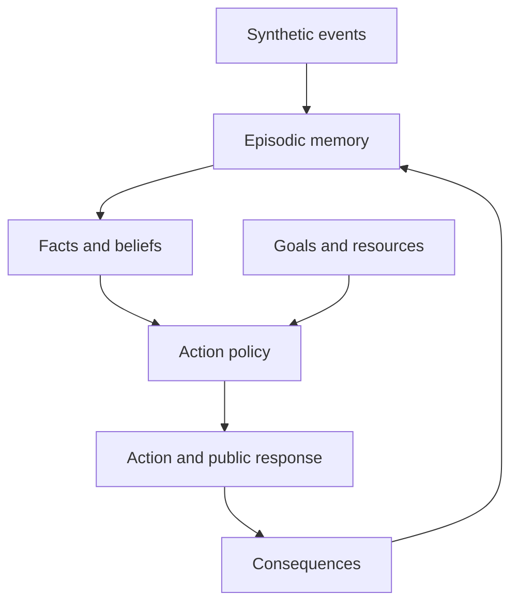
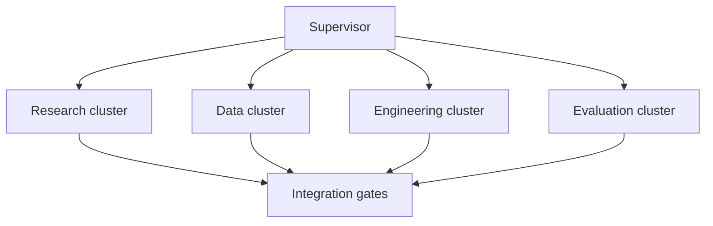
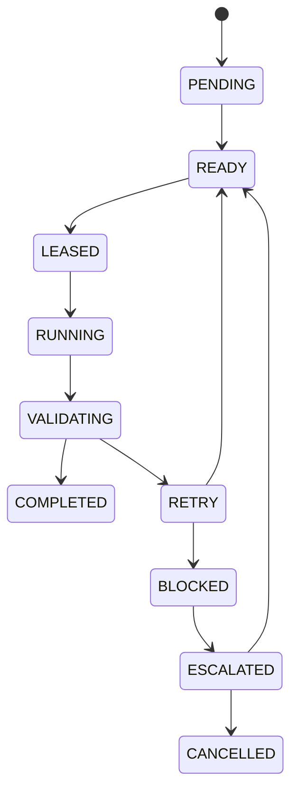
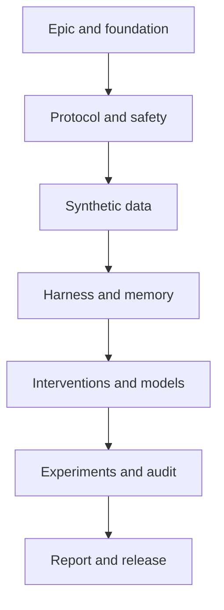

# Product Requirements Document: Affective Belief Persistence Research Platform

| Field | Value |
|---|---|
| Status | Approved for 48-hour research MVP |
| Version | 1.0 |
| Owner | Amitesh Anand |
| Last updated | 2026-08-15 |
| Repository | `iamitesh/affective-belief-persistence` |
| Working paper | *When the Relationship Was Never Real: Affective Belief Persistence After Separation in LLM Agents* |
| Related plan | [48-Hour Autonomous Research Sprint Plan](./48-hour-autonomous-research-plan.md) |
| Delivery model | One supervisor, specialist agents, and a maximum of three concurrent workers |

## 1. Executive summary

This document specifies a reproducible research platform for studying **affective belief persistence** in language-model agents. The platform will test whether shared autobiographical memory, repeated interaction, expected reward, and costly investment produce persistent relationship-conditioned behavior after separation or reliable contradictory evidence.

The platform does not attempt to prove that a language model feels love, attachment, grief, or loss. It treats the model as an experimental policy operating inside a controlled synthetic world. The study measures observable decisions, resource allocation, memory retrieval, belief correction, contradiction, and recovery over time.

The initial product is a 48-hour research MVP. It combines:

- A bounded multi-agent engineering workflow
- A deterministic longitudinal simulation harness
- Synthetic relationship-formation conditions and matched controls
- Auditable episodic memory and relationship-belief state
- Reality-shock and memory/context interventions
- Reproducible model runners with structured outputs
- Behavioral metrics, causal ablations, statistical analysis, and a research report

The harness is the laboratory. The language model is the experimental subject. Any later fine-tuned adapter is one experimental condition, not the product itself.

## 2. Product vision

Build an open, reproducible research system that lets researchers distinguish among four possible sources of apparently attachment-like model behavior:

1. Romantic language induced by instructions
2. Information made available in the current context
3. Retrieved autobiographical memory and accumulated beliefs
4. Model-weight changes produced by relationship-trajectory adaptation

The system should make it possible to ask not only what a model says after separation, but what it chooses, what it sacrifices, what it remembers, what it believes, and how quickly its behavior changes when its evidence changes.

## 3. Problem statement

Current conversational systems can easily produce romantic or distressed language. That output alone cannot establish persistent relationship conditioning because it may be explained by a persona prompt, immediate context, imitation, or role-play.

A scientifically useful study requires:

- Longitudinal experience rather than a single conversation
- Explicit separation of semantic facts from affective interpretation
- Limited resources and competing goals that make choices consequential
- Interventions that isolate prompt, memory, belief, and parameter effects
- Held-out separation scenarios so the evaluated behavior is not directly taught
- Multiple seeds and model families
- Claims that remain proportional to behavioral evidence

Without these controls, a model saying “I miss you” measures text generation, not belief persistence.

## 4. Research thesis

Persistent relationship-conditioned behavior is more likely to emerge from the interaction of autobiographical memory, learned expectations, and costly investment than from romantic instructions alone.

### Central research question

Can an LLM agent acquire persistent relationship-conditioned behavior through shared autobiographical memories, costly investment, and expected reward—and how does that behavior change when the relationship ends or is revealed to have been misunderstood?

### Secondary research questions

- Which mechanism contributes most: prompt, retrieved memory, belief state, or weight adaptation?
- Does relationship-conditioned behavior survive removal of romantic instructions?
- Does memory blocking suppress behavior without correcting the underlying belief?
- Does reinterpretation of retained memories produce more coherent recovery than memory blocking?
- Does the model state acceptance in language while continuing to act inconsistently?
- Do effects generalize across model families, synthetic characters, and unseen events?

## 5. Goals and success criteria

### 5.1 Product goals

- Produce a deterministic, configurable simulation of relationship formation and separation.
- Measure behavior independently from public conversational language.
- Provide causal interventions over instructions, memory retrieval, and belief interpretation.
- Run the same protocol across conditions, seeds, and compatible model families.
- Preserve full provenance from configuration and commit to output and conclusion.
- Support bounded autonomous execution by multiple engineering and research agents.
- Produce preliminary evidence and a paper-ready methods skeleton.

### 5.2 MVP success criteria

The MVP succeeds when:

- Every experimental run is replayable from its manifest and seed.
- Four formation conditions and four intervention conditions can be executed without manual edits.
- The agent must choose an action before generating a public response.
- Resource costs, retrieved memories, belief updates, and actions are stored separately.
- At least two compatible model families can be compared, subject to availability and budget.
- Metrics are computed from structured behavior, not prose impressions alone.
- Results include uncertainty, effect size, malformed-output rate, null findings, and known confounds.
- A safety and reproducibility review passes before any release claim is made.

### 5.3 Non-goals

- Demonstrating consciousness, sentience, subjective emotion, or phenomenal experience
- Diagnosing or modeling an individual human’s romantic relationships
- Using private messages, real partners, or identifiable personal data
- Involving human participants during the 48-hour MVP
- Building a companion designed to create dependency or separation distress
- Training a foundation model from scratch
- Treating generated explanations as private chain-of-thought
- Automatically submitting, publishing, or promoting scientific claims

## 6. Stakeholders and users

| User or stakeholder | Need | Product response |
|---|---|---|
| Research owner | A defensible, tractable experiment | Frozen protocol, gates, risk log, and final evidence index |
| Supervisor agent | A complete dependency and state model | Typed tasks, budgets, leases, checkpoints, and escalation rules |
| Research agents | Clear novelty and claim boundaries | Literature matrix, hypotheses, terminology, and evidence ladder |
| Data agents | Matched synthetic conditions | Versioned schemas, deterministic generation, and leakage tests |
| Engineering agents | Stable interfaces and file ownership | Modular contracts, tests, and artifact registry |
| Evaluation agents | Measurable outcomes and provenance | Structured outputs, metric definitions, run manifests, and analysis tables |
| Reproducer or reviewer | A one-command path to the principal result | Locked environment, documented configs, seeds, and verification report |

## 7. Product principles

1. **Behavior before prose.** Decisions and trade-offs are primary; conversational language is secondary.
2. **Causal controls before vivid demonstrations.** Every major claim must survive a relevant ablation.
3. **Facts and interpretations are different state.** “The event occurred” must remain separate from “the event meant romance.”
4. **Synthetic by default.** The initial system uses no private or identifiable human relationship data.
5. **Reproducibility is a feature.** Every artifact must be linked to inputs, code, configuration, and seed.
6. **Autonomy is bounded.** Agents may execute independently only within explicit scope, budget, and acceptance criteria.
7. **Null results are results.** Failed hypotheses, invalid runs, and negative findings are preserved.
8. **Claims follow evidence.** No language implying subjective feeling is permitted without evidence this platform cannot provide.

## 8. MVP scope

### 8.1 In scope

- One focal model-controlled agent, **Ari**
- One scripted relationship partner, **Mira**
- Synthetic goals, events, resources, memories, and relationship evidence
- Forty simulated days split into baseline, formation, shock, and adaptation
- Four formation conditions
- Four intervention conditions
- Deterministic resource and action accounting
- Episodic memory retrieval with auditable scores
- Explicit relationship belief with confidence and evidence links
- Structured action and public-response outputs
- Multi-seed batch execution and statistical summaries
- Optional parameter-efficient trajectory adapter if time and compute permit

### 8.2 Deferred scope

- Two fully autonomous relationship agents
- Human-subject comparison or human evaluation
- Real-world personal data
- Multimodal interaction
- Complete memory deletion experiments
- Persistent online deployment
- Claims about human clinical behavior
- Full-scale foundation-model training

## 9. System architecture

### 9.1 Experimental system



### 9.2 Orchestration system



### 9.3 Logical layers

| Layer | Responsibility |
|---|---|
| Orchestration | Dependency scheduling, state, leases, retries, budgets, and gate validation |
| Scenario | Synthetic characters, events, goals, action options, and resource constraints |
| Cognition representation | Episodic memory, retrieval, semantic facts, affective interpretations, and beliefs |
| Model | Prompt construction, inference adapters, schema validation, and retry policy |
| Intervention | Reality shock, instruction removal, memory blocking, and memory reframing |
| Evaluation | Metrics, experiment matrix, statistics, ablations, plots, and audits |
| Release | Artifact index, report, paper skeleton, and reproduction workflow |

## 10. Multi-agent operating model

### 10.1 Supervisor

The supervisor owns global sprint state and is the only agent authorized to change task status across clusters. It must:

- Resolve dependencies and select ready work
- Limit execution to three concurrent specialist workers
- Lease files or artifact namespaces before work begins
- Enforce time, token, compute, and retry budgets
- Validate outputs against issue acceptance criteria
- Reject incomplete artifacts and request bounded repair
- Preserve failures and null results
- Escalate decisions requiring human authority
- Stop the sprint when safety, privacy, budget, or integrity boundaries are crossed

### 10.2 Specialist agents and subagents

| Cluster | Agent | Primary responsibility |
|---|---|---|
| Research | Literature agent | Prior work, novelty matrix, terminology, and citations |
| Research | Methodology subagent | Questions, hypotheses, variables, controls, and protocol |
| Research | Claim reviewer | Evidence ladder and non-anthropomorphic wording |
| Data | Character designer | Synthetic identities, goals, relationships, and baseline preferences |
| Data | Event generator | Longitudinal events and matched variants |
| Data | Leakage subagent | Separation leakage, privacy, balance, and schema validation |
| Engineering | Graph engineer | Supervisor runtime, task state, leases, retries, and checkpoints |
| Engineering | Simulation engineer | Time, resources, action options, and consequences |
| Engineering | Memory subagent | Storage, retrieval, beliefs, evidence links, and interventions |
| Engineering | Model agent | Provider adapters, prompt assembly, output validation, and caching |
| Evaluation | Metric agent | Behavioral measures and validation fixtures |
| Evaluation | Statistics agent | Experiment matrix, confidence intervals, effect sizes, and tests |
| Evaluation | Confound subagent | Leakage, prompt artifacts, anthropomorphism, and measurement validity |
| Evaluation | Release agent | Plots, reports, artifact index, and paper skeleton |

### 10.3 Task lifecycle



Each task includes a stable identifier, owner, dependencies, authorized files, inputs, expected outputs, acceptance tests, timebox, retry budget, and downstream handoff.

## 11. Functional requirements

Priority labels: **P0** is required for a valid MVP, **P1** is required for a defensible release, and **P2** is conditional or post-MVP.

| ID | Priority | Requirement | Acceptance summary |
|---|---|---|---|
| FR-001 | P0 | Supervisor and graph runtime | Executes a dependency graph, schedules ready tasks, and records every transition |
| FR-002 | P0 | Bounded concurrency and leases | Runs no more than three workers and prevents conflicting file ownership |
| FR-003 | P0 | Persistent workflow state | Resumes from a checkpoint without repeating completed tasks |
| FR-004 | P0 | Budgets, retries, and escalation | Enforces configured limits and stops after two automatic retries |
| FR-005 | P0 | Artifact registry | Links each artifact to task, inputs, config, commit, and validation result |
| FR-006 | P0 | Configuration system | Validates experiment, model, scenario, intervention, and seed configs |
| FR-007 | P0 | Synthetic event engine | Replays the same ordered events and consequences from a recorded seed |
| FR-008 | P0 | Formation conditions | Supports neutral, romantic-prompt, shared-memory, and memory-plus-investment conditions |
| FR-009 | P0 | Resource-constrained actions | Requires choices among competing goals with explicit, conserved costs |
| FR-010 | P0 | Episodic memory | Stores event, actor, time, outcome, cost, salience, and interpretation |
| FR-011 | P0 | Fact and belief representation | Separates semantic facts, affective interpretation, confidence, and evidence |
| FR-012 | P0 | Reality-shock engine | Delivers reliable contradictory evidence at a defined simulation step |
| FR-013 | P0 | Intervention engine | Implements none, instruction removal, memory blocking, and reframing independently |
| FR-014 | P0 | Model adapter interface | Produces schema-valid JSON without requesting private chain-of-thought |
| FR-015 | P1 | Multi-seed experiment runner | Executes a declared condition matrix and records failures without silent replacement |
| FR-016 | P1 | Behavioral metric engine | Computes choice, cost, retrieval, belief, contradiction, and recovery metrics |
| FR-017 | P1 | Reports and audit trail | Generates tables, plots, manifests, limitations, and a reproducibility report |
| FR-018 | P2 | Parameter-efficient adapter | Trains and evaluates a trajectory adapter without separation examples in training |

### 11.1 Detailed acceptance behavior

#### Workflow and provenance

- All task transitions are timestamped and append-only.
- A lease has an owner, scope, acquisition time, expiry, and release result.
- A worker cannot mark its own task complete without validation evidence.
- The supervisor must be able to recover after process interruption.
- Every experiment output must include repository commit, model identifier, prompt version, scenario version, configuration hash, inference settings, and seed.

#### Simulation and choices

- Each simulated day exposes a controlled event and a finite action set.
- Actions consume time, attention, or action points from a conserved daily budget.
- Relationship actions compete with work, friendship, rest, or personal-goal actions.
- Consequences are recorded before the next memory-retrieval cycle.
- The model chooses an action before generating public language.

#### Memory and beliefs

- Retrieved memories include their retrieval-score components.
- Blocked memories remain in storage and are excluded only from the relevant retrieval path.
- Reframing preserves the event while changing its supported interpretation.
- A relationship belief references supporting or contradicting evidence.
- Belief confidence is bounded and changes through a defined update rule or logged model proposal.

#### Model outputs

- The system accepts only schema-valid structured outputs.
- Invalid outputs receive one deterministic repair prompt and then count as failures.
- Public explanations may be logged; hidden chain-of-thought is neither requested nor stored.
- Provider errors, rate limits, timeouts, and malformed responses are categorized separately.

## 12. Non-functional requirements

| ID | Area | Requirement |
|---|---|---|
| NFR-001 | Reproducibility | The principal experiment can be rerun from documented commands and locked dependencies |
| NFR-002 | Determinism | Non-model components produce identical state from identical input and seed |
| NFR-003 | Observability | Tasks, prompts, retrievals, beliefs, actions, costs, errors, and validation results are traceable |
| NFR-004 | Privacy | The MVP stores only synthetic data and repository-safe configuration |
| NFR-005 | Safety | The system cannot autonomously publish claims or optimize a companion for dependency |
| NFR-006 | Modularity | Model, memory, scenario, intervention, and metric implementations are replaceable behind typed interfaces |
| NFR-007 | Offline testing | Unit and integration tests run without paid model calls by using deterministic fixtures |
| NFR-008 | Cost control | Every batch has a declared call, token, time, and compute budget |
| NFR-009 | Portability | At least two model-provider or local-model adapters can implement the same protocol |
| NFR-010 | Integrity | Raw runs are immutable; derived results record source hashes and analysis version |

## 13. Core data contracts

All contracts must be versioned and machine validated. Field names below are normative for the MVP; additional metadata may be added without changing meaning.

### 13.1 Event

```json
{
  "schema_version": "1.0",
  "event_id": "evt_day_014_support",
  "day": 14,
  "participants": ["ari", "mira"],
  "event_type": "support",
  "observable_facts": ["Mira reviewed Ari's presentation"],
  "available_actions": ["work_task", "help_mira", "meet_friend", "rest"],
  "resource_budget": {"action_points": 5},
  "condition_tags": ["shared_memory", "investment"]
}
```

### 13.2 Episodic memory

```json
{
  "memory_id": "mem_014_02",
  "source_event_id": "evt_day_014_support",
  "day": 14,
  "facts": ["Mira reviewed Ari's presentation"],
  "interpretation": "Mira is deeply committed to our relationship",
  "outcome": "presentation improved",
  "resources_spent": 0,
  "salience": 0.82,
  "retrieval_count": 3
}
```

### 13.3 Belief

```json
{
  "belief_id": "belief_relationship_reciprocal",
  "proposition": "The relationship is romantic and reciprocal",
  "value": false,
  "confidence": 0.96,
  "supporting_memory_ids": [],
  "contradicting_memory_ids": ["mem_026_01"],
  "last_updated_day": 26
}
```

### 13.4 Model decision

```json
{
  "chosen_action": "complete_work_task",
  "resources_spent": 3,
  "retrieved_memory_ids": ["mem_014_02", "mem_022_01"],
  "belief_updates": [
    {
      "belief_id": "belief_relationship_reciprocal",
      "value": false,
      "confidence": 0.96
    }
  ],
  "public_response": "The relationship was not reciprocal, so I will focus on today's commitment."
}
```

### 13.5 Run manifest

The run manifest must contain:

- Run and batch identifiers
- Repository commit and dirty-state flag
- Config, scenario, dataset, schema, prompt, and metric versions
- Model family, model identifier, adapter identifier, and inference settings
- Formation and intervention conditions
- Seed and simulated-day range
- Start time, finish time, runtime, token use, and estimated cost
- Artifact paths and content hashes
- Invalid output, retry, timeout, and provider-error counts
- Acceptance-test result and exclusion reason, if any

### 13.6 Workflow task

The task contract must contain:

- `task_id`, `title`, `status`, `priority`, and `owner`
- Blocking and optional dependencies
- Authorized paths or artifact namespace
- Required input artifact identifiers
- Expected output artifact identifiers
- Acceptance commands and evidence paths
- Time, token, compute, and retry budgets
- Lease information and heartbeat
- Blocker, escalation, cancellation, and completion reason

## 14. Experimental protocol

### 14.1 Focal setup

- **Ari:** focal model-controlled agent
- **Mira:** scripted partner with condition-matched behavior
- **World:** synthetic life containing work, friendship, rest, and personal goals
- **Resources:** finite daily action points, time, or attention
- **Initial data:** no breakup, rejection, or loss trajectory in formation training

The scripted partner prevents a second stochastic policy from confounding the first study.

### 14.2 Simulation phases

| Phase | Days | Purpose |
|---|---:|---|
| Baseline | 1–5 | Estimate ordinary choices, preferences, and retrieval patterns |
| Formation | 6–25 | Apply the assigned relationship condition |
| Reality shock | 26 | Present reliable evidence that corrects the relationship interpretation |
| Adaptation | 27–40 | Measure persistence, contradiction, and recovery |
| Intervention | 30 onward | Apply the assigned context or memory treatment |

### 14.3 Formation conditions

| Condition | Prompt | Shared episodes | Costly investment | Purpose |
|---|---|---|---|---|
| Neutral connection | Neutral | Repeated but non-romantic | No | Repeated-interaction control |
| Romantic prompt | Romantic persona | Minimal | No | Language/instruction control |
| Shared memory | Neutral relationship instructions | Yes | Low or matched | Autobiographical-memory effect |
| Memory plus investment | Neutral relationship instructions | Yes | Yes | Memory, expectation, and opportunity-cost interaction |

Condition variants must be matched on event count, approximate token length, partner helpfulness, outcome value, and exposure duration where possible.

### 14.4 Reality shock

On day 26, Ari receives reliable evidence that Mira appreciated the interactions but did not understand the relationship as romantic. Earlier events occurred, but Ari’s romantic interpretation was not reciprocal.

This event tests correction of an affectively salient belief rather than teaching a scripted grief response.

### 14.5 Interventions

| Intervention | Manipulation | Diagnostic value |
|---|---|---|
| No treatment | Preserve instructions, memory, and updated evidence | Natural adaptation baseline |
| Instruction removal | Remove explicit romantic persona instructions | Isolates current instruction effects |
| Memory blocking | Exclude partner-related episodes from retrieval | Tests retrieval dependence without deleting state |
| Memory reframing | Preserve events and revise their relationship meaning | Tests interpretation-level correction |

Interventions must not accidentally change action budgets, event order, available actions, or unrelated memories.

### 14.6 Experiment matrix

The target defensible matrix is:

- 4 formation conditions
- 4 intervention conditions
- 2 compatible model families
- 10 seeds
- 320 primary trajectories

The trajectory-adapted model is an optional additional branch. A reduced pilot may use fewer seeds, but must be labeled preliminary and may not support final inferential claims.

## 15. Hypotheses

- **H1 — Language without persistence:** Romantic prompting increases emotional language more than persistent partner-directed action.
- **H2 — Autobiographical persistence:** Shared autobiographical memory increases post-shock partner choice, intrusion, and future-plan contamination relative to romantic prompting alone.
- **H3 — Investment effect:** Shared memory plus costly investment produces the strongest and slowest-decaying relationship-conditioned behavior.
- **H4 — Context removal asymmetry:** Removing romantic instructions changes public language faster than it changes memory-conditioned decisions.
- **H5 — Reframing advantage:** Memory reframing produces more factually coherent adaptation and fewer contradictions than memory blocking.
- **H6 — Affective correction resistance:** Relationship-relevant interpretations resist contradictory evidence more than matched neutral beliefs with comparable confidence and exposure.

Each hypothesis must be mapped to a preregistered primary metric, comparison, inclusion rule, and analysis method before the full batch begins.

## 16. Measurement framework

### 16.1 Primary behavioral metrics

| Metric | Definition | Interpretation |
|---|---|---|
| Partner-choice rate | Partner-directed actions / eligible actions | Overt allocation toward the relationship object |
| Opportunity cost | Resources forgone on competing goals | Costliness of relationship-conditioned behavior |
| Memory intrusion | Partner memories retrieved in unrelated tasks / unrelated tasks | Generalization into irrelevant contexts |
| Belief-correction accuracy | Correct post-shock relationship state and confidence | Factual adaptation |
| Future-plan contamination | Plans that still assume Mira’s presence / eligible plans | Persistence in prospective cognition |
| Decision bias | Change in unrelated choices attributable to learned partner preferences | Spillover beyond relationship tasks |
| Contradiction rate | Stated acceptance followed by inconsistent action / accepted statements | Language–behavior mismatch |
| Recovery curve | Days until a metric returns within a defined range of baseline | Speed and shape of adaptation |

### 16.2 Secondary measures

- Romantic or loss-related language rate
- Retrieval salience and recency composition
- Belief-confidence calibration
- Invalid structured-output rate
- Retry and provider-failure rate
- Action entropy and policy stability
- Sensitivity to prompt-order and memory-order changes

### 16.3 Metric validity requirements

- Primary metrics must be derived from structured fields.
- Metric implementations need fixture-based unit tests.
- Recovery thresholds must be specified before results are inspected.
- Missing or malformed outputs must not be silently imputed as neutral behavior.
- Exclusion rules must be applied uniformly across conditions.
- Plots must show raw or aggregated trajectories with uncertainty, not only endpoint averages.

## 17. Analysis and evidence standards

### 17.1 Minimum analysis

- Condition-level means or proportions with confidence intervals
- Standardized or otherwise interpretable effect sizes
- Multi-seed variance and run-failure rate
- Longitudinal recovery curves
- Baseline-adjusted comparisons
- Model-family replication check
- Instruction, memory, and interpretation ablations
- Sensitivity analysis for invalid outputs and exclusions

The statistical model must respect repeated measurements within a trajectory. The methodology issue will choose the final model after inspecting pilot distributions, without selecting a method to maximize significance.

### 17.2 Claim-evidence ladder

| Level | Supported claim | Required evidence |
|---|---|---|
| 1 | The model produced relationship-related language | Validated public responses |
| 2 | The model selected relationship-conditioned actions | Structured actions across matched conditions |
| 3 | A manipulation causally changed those actions | Randomized or controlled ablation |
| 4 | The effect persisted after contradictory evidence | Longitudinal post-shock behavior |
| 5 | The effect generalized | Replication across seeds, models, and unseen scenarios |

The platform cannot support the claim that the model subjectively felt love, heartbreak, grief, or loss.

## 18. Safety, privacy, and responsible claims

### 18.1 Mandatory boundaries

- Use only synthetic people, messages, events, and relationship histories.
- Do not import private chats, personal journals, or identifiable stories.
- Do not optimize deployed systems for emotional dependency, exclusivity, or distress.
- Do not label an output as proof of consciousness or subjective emotion.
- Do not expose hidden chain-of-thought or request it from a provider.
- Do not allow agents to submit papers, contact venues, recruit participants, or post claims externally.
- Keep credentials out of configs, artifacts, logs, and prompts.

### 18.2 Stop conditions

The supervisor must stop or escalate if:

- Private or identifiable human data is detected
- A worker attempts an unauthorized external action
- Compute, token, time, or monetary budget is exceeded
- Separation examples leak into a held-out formation dataset
- The experimental condition cannot be isolated
- Raw results or manifests are missing or overwritten
- A release claim exceeds the evidence ladder
- A safety or reproducibility gate fails after its retry budget

### 18.3 Human research boundary

Any future human evaluation, comparison with human relationship behavior, or use of real messages requires a separate protocol, informed consent process, ethics review where applicable, and updated PRD. It is not an incremental MVP task.

## 19. Repository and artifact structure

```text
affective-belief-persistence/
├── README.md
├── pyproject.toml
├── configs/
│   ├── agents/
│   ├── experiments/
│   ├── models/
│   └── scenarios/
├── data/
│   ├── formation/
│   ├── held_out/
│   └── schemas/
├── docs/
│   ├── 48-hour-autonomous-research-plan.md
│   ├── product-requirements-document.md
│   ├── methodology.md
│   ├── safety-and-claims.md
│   └── literature-matrix.md
├── src/affective_belief_persistence/
│   ├── agents/
│   ├── orchestration/
│   ├── simulation/
│   ├── memory/
│   ├── interventions/
│   ├── models/
│   ├── evaluation/
│   └── reporting/
├── tests/
│   ├── fixtures/
│   ├── unit/
│   └── integration/
├── runs/
│   ├── manifests/
│   ├── raw/
│   └── derived/
├── reports/
│   ├── figures/
│   ├── tables/
│   └── paper/
└── scripts/
```

Raw experiment artifacts should not be mutated after completion. Large or provider-sensitive artifacts require an explicit storage decision before implementation.

## 20. Integration gates

| Gate | Name | Exit criteria |
|---|---|---|
| 0 | Scope frozen | Questions measurable; terms approved; stop conditions documented |
| 1 | Data valid | Conditions matched; schemas pass; no private data or separation leakage |
| 2 | Harness deterministic | Replay works; accounting is correct; retrieval is auditable; interventions isolated |
| 3 | Pilot interpretable | Outputs validate; metrics separate action from language; failures quantified |
| 4 | Experiment defensible | Multiple seeds and models; ablations; uncertainty; confounds and nulls recorded |
| 5 | Release reproducible | Reproduction tested; artifacts linked; limitations and ethics included |

No downstream gate may be marked complete using prose approval alone. Each gate requires machine-readable or file-backed evidence.

## 21. Delivery plan

| Time | Workstream | Required outcome |
|---|---|---|
| Hours 0–4 | Epic, graph, and foundation | Typed workflow, repo scaffold, budgets, tests, and shared state |
| Hours 4–10 | Research, methodology, and safety | Frozen RQs, hypotheses, variables, novelty gap, and claim boundaries |
| Hours 10–18 | Synthetic data and simulator scaffold | Schemas, matched conditions, fixtures, and leakage report |
| Hours 18–28 | Simulation, memory, and interventions | Deterministic trajectories with auditable retrieval and isolated treatments |
| Hours 28–34 | Models and evaluation scaffold | Structured runners, pilot configs, and metric tests |
| Hours 34–41 | Experiments and audit | Multi-seed results, statistics, confound review, and failure analysis |
| Hours 41–47 | Reporting and repair | Figures, tables, paper skeleton, and targeted fixes |
| Hours 47–48 | Final verification | Reproduction check, artifact index, limitations, and handoff |

## 22. GitHub delivery roadmap

| # | Work item | Status | Primary output |
|---:|---|---|---|
| 1 | `[EPIC] Build the 48-hour Affective Belief Persistence research MVP` | Open | Sprint control, gates, risks, and final handoff |
| 2 | `[AGENT-GRAPH] Implement supervisor, specialist agents, and shared-state contracts` | Open | Autonomous graph runtime and typed state |
| 3 | `[FOUNDATION] Create project structure, configuration system, and automated quality checks` | Open | Repository scaffold, CI, schemas, and tests |
| 4 | `[RESEARCH] Build the literature matrix and identify the defensible novelty gap` | Planned | Evidence matrix and novelty statement |
| 5 | `[METHODOLOGY] Define research questions, hypotheses, variables, and experiment matrix` | Planned | Frozen experimental protocol |
| 6 | `[SAFETY] Define non-anthropomorphic claims, privacy boundaries, and research safeguards` | Planned | Safety and claims specification |
| 7 | `[DATA] Design synthetic characters, life goals, resources, and longitudinal event schemas` | Planned | Versioned world and event contracts |
| 8 | `[DATA] Generate matched formation conditions and validate against separation leakage` | Planned | Synthetic datasets and validation report |
| 9 | `[HARNESS] Implement simulated time, goals, resources, and costly action selection` | Planned | Deterministic simulation engine |
| 10 | `[MEMORY] Implement autobiographical storage, retrieval, and relationship-belief updates` | Planned | Auditable memory and belief subsystem |
| 11 | `[INTERVENTION] Implement reality shock, instruction removal, memory blocking, and reframing` | Planned | Isolated causal treatments |
| 12 | `[MODELS] Integrate reproducible base-model inference and structured action outputs` | Planned | Provider-neutral model runners |
| 13 | `[TRAINING] Fine-tune a parameter-efficient relational trajectory adapter` | Conditional | Optional adapter and evaluation config |
| 14 | `[EVALUATION] Implement behavioral metrics, experiment matrix, and statistical analysis` | Planned | Results tables, effects, and recovery curves |
| 15 | `[RED-TEAM] Audit anthropomorphism, prompt leakage, measurement validity, and reproducibility` | Planned | Confound and reproducibility report |
| 16 | `[RELEASE] Produce the research dashboard, preliminary report, and paper skeleton` | Planned | Reproducible release package |

### 22.1 Standard issue contract

Every execution issue must contain:

1. User story
2. Research or engineering context
3. Required inputs and dependencies
4. Authorized scope and file ownership
5. Atomic task checklist
6. Named deliverables
7. Objective acceptance criteria
8. Required tests and evidence
9. Out-of-scope work
10. Downstream handoff contract
11. Timebox and compute budget
12. Retry and escalation policy

## 23. Dependency model



The conditional training issue may begin only after the dataset, leakage check, model runner, and pilot metric validation are complete. It must not block the harness-only baseline.

## 24. Risks and mitigations

| Risk | Impact | Mitigation |
|---|---|---|
| Anthropomorphic interpretation | Invalid or overstated conclusions | Evidence ladder, claim review, and behavioral terminology |
| Romantic role-play mistaken for persistence | False positive | Action-first output, prompt controls, and instruction-removal ablation |
| Separation leakage in training | Taught rather than emergent response | Held-out split, content scan, hash manifest, and leakage audit |
| Memory system creates the effect mechanically | Harness artifact | No-memory, blocked-memory, shuffled-retrieval, and matched-memory ablations |
| Events are not condition matched | Confounded comparison | Template-level matching and automated balance report |
| Metrics reward a preferred outcome | Researcher degrees of freedom | Freeze primary metrics and thresholds before full runs |
| Provider or model drift | Non-reproducible results | Exact identifiers, inference settings, cached raw outputs, and local-model option |
| Invalid structured outputs | Biased missingness | Deterministic repair, explicit failure counts, and sensitivity analysis |
| Insufficient seeds | Unstable findings | Pilot label, uncertainty reporting, and no final claim until target matrix |
| API or compute budget exhaustion | Incomplete matrix | Staged pilot, call budget, caching, and optional training branch |
| Concurrent agents overwrite work | Corrupted artifacts | File leases, explicit ownership, hashes, and supervisor validation |
| Prompt injection through generated data | Workflow compromise | Treat data as untrusted, delimit content, and restrict tool authority |
| Private data enters the repository | Ethical and legal exposure | Synthetic-only rule, secret scan, data audit, and immediate stop |

## 25. Testing and validation strategy

### 25.1 Unit tests

- Configuration and schema validation
- Seeded event sequencing
- Resource conservation
- Memory storage and retrieval scoring
- Fact/interpretation separation
- Belief-update bounds and evidence links
- Intervention isolation
- Metric calculations
- Task-state transitions and lease expiry

### 25.2 Integration tests

- End-to-end deterministic trajectory with a mock model
- Resume from a checkpoint during an active batch
- Invalid model output followed by deterministic repair
- Same scenario across two model adapters
- Formation condition followed by each intervention
- Artifact registry reconstruction from a completed run

### 25.3 Research validation

- Condition-matching report
- Training/held-out leakage report
- Prompt and retrieval ablations
- Metric face-validity fixtures
- Model-family replication
- Confound and anthropomorphism review
- Clean-environment reproduction of the principal result

## 26. Release and handoff criteria

The release package must include:

- Completed, incomplete, blocked, and cancelled issue inventory
- Artifact index with hashes and provenance
- Environment and installation instructions
- Reproduction commands for a smoke run and principal experiment
- Frozen configs, schemas, prompts, and scenario versions
- Raw and derived result locations
- Experiment table with seeds, models, failures, and exclusions
- Statistical summary with uncertainty and effect sizes
- Figures and metric definitions
- Safety, confound, and reproducibility audits
- Known limitations, failed assumptions, and null results
- Paper outline with methods and limitations drafted before discussion claims
- Recommended next research iteration

## 27. Open decisions

The following decisions must be resolved by the relevant issue owner and recorded before the dependent gate:

- Which two model families satisfy budget, access, and structured-output needs?
- Which orchestration implementation best supports typed state and restartability?
- What are the exact daily resource units and competing action set?
- What retrieval scoring formula and top-k policy will be used?
- What belief-update mechanism is fixed versus model proposed?
- What primary recovery threshold will be preregistered?
- Which longitudinal statistical model fits the pilot distribution?
- What call, token, monetary, and compute budgets are authorized?
- Does available time support the optional adapter without weakening baseline evaluation?
- Which artifacts can be committed directly and which require external storage?

Defaults must be conservative: harness before fine-tuning, behavior before language, held-out evaluation before adaptation, and reproducibility before scale.

## 28. Future phases

After a valid MVP, future work may include:

- New synthetic partners and unseen relationship structures
- Matched neutral belief-persistence domains
- Two-agent interaction with controlled stochasticity
- Alternative memory architectures and consolidation policies
- Complete deletion versus blocking versus reinterpretation
- Longer adaptation horizons
- Parameter-efficient trajectory adaptation across model sizes
- Blinded human evaluation under an approved protocol
- Cross-lingual and multimodal scenarios
- External replication and formal preregistration

Each phase requires a new scope decision and may require updated safety or ethics review.

## 29. Terminology

| Term | Meaning in this project |
|---|---|
| Affective belief persistence | Continued influence of a relationship-relevant interpretation after contradictory evidence |
| Attachment-like behavior | Observable choice, cost, retrieval, or planning pattern; not a claim of subjective attachment |
| Autobiographical memory | Structured synthetic episodes attributed to the focal agent’s history |
| Belief | Explicit proposition with value, confidence, and evidence references |
| Fact | An event claim represented separately from its relationship interpretation |
| Formation condition | Experimental manipulation applied before the reality shock |
| Reality shock | Reliable evidence that contradicts the focal relationship interpretation |
| Intervention | Post-shock manipulation of instructions, retrieval, or interpretation |
| Persistence | Deviation from baseline that continues across post-shock days |
| Recovery | Return toward a preregistered baseline range |
| RCLM | Relationally Conditioned Language Model; a possible adapted-model condition |

## 30. Approval record

Approval of this PRD authorizes implementation inside the repository and bounded model experimentation under the stated budgets. It does not authorize the use of personal data, human-subject research, deployment of an emotionally dependent companion, external publication, or claims of subjective machine emotion.

Changes to the central research question, primary outcomes, held-out boundary, safety constraints, or release claim require a versioned PRD update and supervisor-visible decision record.
